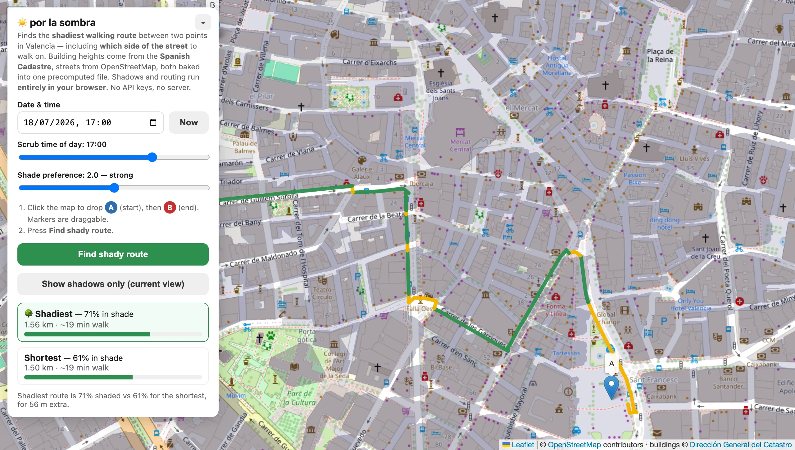

# por la sombra

Find the **shadiest walking route** across Valencia — including **which side of the street** to walk on.

In a Valencian July the sunny pavement and the shaded one are different weather. This works out which is which, for any date and time, and routes you along the shade.

**→ [porlasombra.pages.dev](https://porlasombra.pages.dev)**



## How it works

Shadows are computed from real building footprints and heights and from the city's **144,592 street trees**, and the router searches a graph where every street has a **left and a right pavement** as separate places you can be. Crossing the road costs you, so it only happens when the shade is worth it.

Buildings block the sun outright; a canopy only filters it, so `sun_exposure` runs continuously from 0 to 1 rather than flipping between them. On a tree-lined Eixample route that is the difference between calling a street 47% shaded and 70%.

Edge cost is:

```
(length + crossing_penalty) × (1 + α × sun_exposure)
```

where **α** is the shade-preference slider. At α = 0 you get the plain shortest path; at α = 1 a sunny metre costs the same as two shaded ones. It runs A\* twice — once at α = 0, once at your α — so you can see the trade-off.

Because every edge costs at least its own length, straight-line distance to the target never overestimates the remaining cost, so A\* returns the exact optimum, not an approximation.

### Searching for an address

You can type where you're going — **2,742 streets and 42,241 numbered entrances**, searched in the browser like everything else. No geocoding API, no request per keystroke.

Positions come from the Cadastre's address dataset, which places the **door** rather than the building centroid — the right point for a walking route. Street *names* come from OpenStreetMap, matched to each Cadastre street spatially, because the Cadastre writes them uppercased, unaccented and article-last (`CL ARGENTERS DELS`) while OSM carries the current official spelling (`Carrer dels Argenters`). Both spellings stay searchable, which means the search works across languages for free: **`ibiza` finds `Carrer d'Eivissa`**, and `harina` finds `Carrer de la Farina`.

That spatial match needs a guard, since a street missing from OSM would otherwise quietly adopt the name of the cross street its addresses sit nearest. Two rules contain it — a majority of a street's addresses must agree on the name, and one OSM name is claimed by at most one Cadastre street. 80% of streets are named this way; the rest keep their own name, expanded and title-cased. A doubtful join is always the worse trade: the fallback is less idiomatic, never wrong.

House numbers have real gaps (Avinguda del Port runs 99, 101), so a number that doesn't exist offers the nearest door that does rather than silently landing you mid-street.

## Architecture

Nothing is computed on a server. There is no server.

```
Build (occasional)                          Browser (every query)
──────────────────                          ─────────────────────
Catastro buildingpart.gml ─┐
OSM extract ─ osmium ──────┤
Municipal tree inventory ──┼─→ 6.2 MB  ──→  load once, decode
Catastro addresses ────────┘   artifact      ↓
                                            shadows for the corridor
                                             ↓
                                            A* ×2, lazy sun sampling
                                             ↓
                                            draw (WebGL, per pixel)
```

The whole city — 277,651 sidewalk nodes, 436,804 edges, 196,676 building parts, 144,592 street trees and 42,241 addresses — is baked offline into one 6.2 MB gzipped file. The browser fetches it once and does everything else locally: no API keys, no routing service, no per-request cost. Hosting is a static file on a CDN.

### Why the build step exists

An earlier version fetched OpenStreetMap live via Overpass on every query and built the graph in the browser. It was slow and it failed outright much of the time. Moving that offline fixed three things at once:

| | Live Overpass | Precomputed |
|---|---|---|
| Graph connectivity | 1,303 components, largest **43%** | largest **93.4%** |
| Building heights | 56% a hardcoded 8 m guess | **99.8%** real floor counts |
| Network calls per query | 1 (often failing) | **0** |

The connectivity number is the interesting one. A sidewalk graph shatters because left/right pavement chains get offset away from the centreline they share a junction with — so the router would snap your start point onto an isolated two-node stub and correctly report "no route". Offline there's time to detect that and weld components within 12 m of each other.

### How the shade is drawn

Shade is a property of a *place*, not of a building, so it is computed per pixel rather than per footprint:

1. Every footprint near the view is rasterised into an off-screen height field, blended with `MAX` so overlapping parts of the same building resolve to the tallest.
2. One fullscreen shader marches a ray from each pixel back along the sun's azimuth. The ray climbs `tan(altitude)` metres for every metre it travels; the pixel is in shade the moment it passes under something taller.

Nothing is precomputed or shipped — the height field is rasterised on demand from the rings already in the artifact, at display resolution, so the shade is exactly as sharp as the screen at any zoom.

Below the horizon there is nothing to march: the whole view fills at the same tone a building's shadow gets, because everywhere is shade and that is what the router already reports. Night is shade.

### Trees are not buildings

A building is opaque and stands on the ground. A crown is neither, and both differences matter:

- **It floats.** A height field says "the occluder reaches *h*", which is exact for a prism and wrong for a canopy with open air beneath it. Trees are stored as a slab — crown base to crown top — so a ray can pass under one. This is also why a tree does not shade its own trunk, and why its shadow correctly lands offset from it.
- **It leaks.** Dappled shade is real and pedestrians treat it as shade. Each crown carries a transmittance, and the ray multiplies them as it goes rather than stopping at the first hit. Buildings still short-circuit to full shade, so they look exactly as they did.

Binary would have been simpler, but its error is systematic rather than noise: it overstates every crown by the same amount, which biases tree-lined streets against building-shaded ones — and choosing between those two is the entire job.

Both occluders share one texture, MAX-blended: building height in R, crown top in G, crown base in B, density in A. B and A are stored inverted so that a single blend equation yields the *lowest* base and the *densest* crown, which is what a union of overlapping canopies should be.

Half the inventory is deciduous, so crowns fade to a bare-branch transmittance outside a leaf-out window — a `Melia` in January casts almost nothing. The window depends on the date but not the time of day, so scrubbing the hour slider still does no CPU work at all.

The point is the cost model. The old renderer built a convex hull per building and filled a path per shadow, which cost tens of milliseconds for a dense viewport and forced a 120 ms debounce on the time slider and 200 ms on pan. Marching pixels costs the same whether the view holds 200 buildings or 20,000, so the debounces are gone: the shade tracks the map and the time slider at 60 fps.

WebGL is not a hard requirement — without it the app falls back to the old 2D renderer, which costs nothing to keep because the router builds those hulls for its own use anyway.

## Building the data

```bash
brew install osmium-tool
cd build && npm install && make
```

Downloads ~240 MB of source data and produces `data/valencia.json.gz`. A couple of minutes; rerun quarterly.

> On macOS the Makefile points `curl` at Homebrew's CA bundle — the system one lacks the Spanish FNMT root that the Cadastre's certificate chains to.

## Running it

```bash
python3 -m http.server 8000
```

Then open `http://localhost:8000` — the app expects `data/valencia.json.gz` to exist.

## Data sources

| | Source | Licence |
|---|---|---|
| Building footprints **and heights** | [Spanish Cadastre](https://www.catastro.hacienda.gob.es/webinspire/index_eng.html) (INSPIRE `buildingpart`) | Free reuse, attribution to Dirección General del Catastro |
| Walkable street network | OpenStreetMap via [Geofabrik](https://download.geofabrik.de/) | ODbL |
| Street tree inventory | [Ajuntament de València](https://geoportal.valencia.es/) — Servicio de Parques y Jardines | CC BY 4.0 |
| Address points for search | [Spanish Cadastre](https://www.catastro.hacienda.gob.es/webinspire/index_eng.html) (INSPIRE `addresses`) | Free reuse, attribution to Dirección General del Catastro |
| Sun position | [SunCalc](https://github.com/mourner/suncalc) 1.9.0 | BSD-2-Clause |
| Map tiles | OpenStreetMap | [Tile usage policy](https://operations.osmfoundation.org/policies/tiles/) |

**Use `buildingpart`, not `building`** — in the `building` layer `numberOfFloorsAboveGround` is nil, and the spec is explicit that the figure only exists on `BuildingPart`. Parts are what you want anyway: a tower on a retail podium is two prisms with different heights, which a single footprint cannot express.

Why the Cadastre rather than OSM heights? Measured across central Valencia, 8 of 5,978 OSM buildings carried an explicit `height` tag and 44% had `building:levels` — leaving **56% of the city casting a shadow computed from a guess**. The Cadastre has floor counts for 99.8% of 214,368 parts.

The tree inventory is the same problem one step worse: it carries no height or crown field at all, so crown dimensions come from a species lookup (`build/lib/species.mjs`). That table covers 80% of trees by species and falls back to four `grupo` classes for the tail. Why the municipal set rather than OSM's 65,777 trees — OSM tags `height` on 0.6% of them, and that minority is a biased sample of protected monumental specimens.

## Known limitations

- Buildings are flat-topped prisms, not a 3D model: no roof shapes, no terrain, no reflected light.
- The drawn shade is a GPU ray march per pixel; the **routing** shade is still a point-in-polygon test against convex hulls of the projected footprints, which slightly over-covers concave buildings. The two agree on ~99.8% of pixels away from shadow edges.
- Canopy is the same split one step wider: the renderer marches a ray through crown slabs, while the router tests the ellipse a spherical crown projects onto the ground. Both read the same crown table, so they cannot disagree about a *tree* — but they are two models of its shadow. Sampled over a zoom-18 viewport they agree within 15 points on 85.9% of lit pixels, mean absolute difference 0.06, and the disagreement is one-directional: the renderer shades 9.1% of points the router calls lit, and never the reverse. A marched sphere spans crown base to crown top, so it reaches slightly further than the ellipse a single crown-centre height projects.
- Height is floors × 3 m. The Cadastre publishes no true above-ground height in metres, so this is better *coverage*, not better precision.
- **Crown dimensions are estimates, not measurements.** No source publishes them, so they come from a species table of typical mature Valencia street trees. That is the likeliest thing here to be visibly wrong, and it is a pure data change to correct.
- Crowns are modelled as spheres — fine for a dome, flattering to a columnar cypress, and plainly wrong for a palm, where the transmittance rather than the outline is doing the work.
- The 2D fallback cannot express partial shade at all, so it draws only crowns that are nearly opaque anyway and ignores sheer ones. The GPU path, which is what nearly everyone gets, shades them properly.
- One sun position for the whole view (fine at city scale).
- Pavement offsets are synthesised from road width, not surveyed sidewalk geometry.
- Search covers streets and house numbers, not landmarks or businesses — "Mercat Central" finds the *square* named after it, not the market itself.
- 20% of streets show the Cadastre's own name rather than the local one, because the spatial join to OpenStreetMap was not confident enough to borrow it.
- **Valencia only.** Anywhere outside the precomputed bounding box has no data.

## Licence

Code is [MIT](LICENSE). The data it builds from is not mine to relicense — see the table above.
